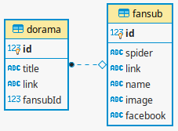

# Passarama - Crawler

Inspeciona páginas de fansubs e extrai lista de doramas disponíveis.

## Como funciona

Antes de executar todas as _spiders_, uma tabela fansub é criada com os dados
de fansub das _spiders_.

Cada _spider_ é responsável por inspecionar um site de uma fansub.
Ele acha doramas, filmes e outros conteúdos de vídeo e retorna seu título e link.

No _pipeline_, os dados do conteúdo de vídeo é armazenado na tabela dorama.



### Spiders das Fansubs

* [kingdom](doramas_crawler/spiders/kingdom.py)
* [kkulbeol](doramas_crawler/spiders/kkulbeol.py)
* [mahal](doramas_crawler/spiders/mahal.py)
* [puripuri](doramas_crawler/spiders/puripuri.py)
* [dorameirason](doramas_crawler/spiders/dorameirason.py)
* [banzai](doramas_crawler/spiders/banzai.py)
* [euamodoramas](doramas_crawler/spiders/euamodoramas.py)
* [yumeko](doramas_crawler/spiders/yumeko.py) (desativada)

## Instalação

Clone o repositório:
```sh
$ git clone https://github.com/djeni98/passarama
$ cd crawler
```

Crie um ambiente virtual e o ative:
```sh
$ python3 -m venv venv
$ . venv/bin/activate
```

Instale as dependências:
```sh
(venv) $ pip install -r requirements.txt
```

Copie logindata.example.py e o popule
```sh
(venv) $ cp logindata.example.py doramas_crawler/spiders/logindata.py
(venv) $ vim doramas_crawler/spiders/logindata.py # edite o arquivo
```

## Execução

```sh
(venv) $ python run.py
```

## Tecnologias e Ferramentas

* [Python](https://www.python.org/) ```3.6```
* [Scrapy](https://docs.scrapy.org/en/2.3/)```2.3.0```

