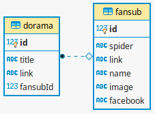

# Passarama - Crawler

Crawl and scrap fansubs pages to get available doramas.

## How it works

Before running all spiders, a fansub table is created with spiders fansub info.

Each spider is responsable for crawl and scrap a fansub site.
It finds doramas, movies and other video contents and return their title and link.

In pipeline, the video content data are stored into dorama table.



### Fansubs spiders

* [kingdom](doramas_crawler/spiders/kingdom.py)
* [kkulbeol](doramas_crawler/spiders/kkulbeol.py)
* [mahal](doramas_crawler/spiders/mahal.py)
* [puripuri](doramas_crawler/spiders/puripuri.py)
* [dorameirason](doramas_crawler/spiders/dorameirason.py)
* [yumeko](doramas_crawler/spiders/yumeko.py) (deactivated)

## Install

Clone the repository:
```sh
$ git clone https://github.com/djeni98/passarama
$ cd crawler
```

Create a virtual environment and activate it:
```sh
$ python3 -m venv venv
$ . venv/bin/activate
```

Install dependencies:
```sh
(venv) $ pip install -r requirements.txt
```

Copy logindata.example.py and populate it
```sh
(venv) $ cp logindata.example.py doramas_crawler/spiders/logindata.py
(venv) $ vim doramas_crawler/spiders/logindata.py # edit file
```

## Run

```sh
(venv) $ python run.py
```

## Technologies and Tools

* [Python](https://www.python.org/) ```3.6```
* [Scrapy](https://docs.scrapy.org/en/2.3/)```2.3.0```

